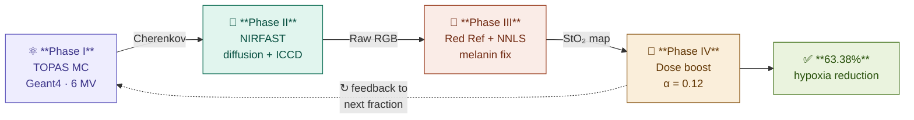

<div align="center">

# ☢️ AURORA-RT

### **A**utonomous · **O**xy-Responsive · **R**adiotherapy · **A**pproach — **R**eal-**T**ime

> 🩺 *Real-Time Oxygen-Guided Adaptive Radiation Therapy*

**A Digital Twin simulation framework for Cherenkov-guided, hypoxia-mediated adaptive radiotherapy**

Integrating TOPAS Monte Carlo · NIRFAST optical diffusion · Virtual ICCD sensing · Deliverability-constrained dose optimization


</div>

---

## 📋 Table of Contents

- [Pipeline at a Glance](#️-pipeline-at-a-glance)
- [Overview](#-overview)
- [Key Results](#-key-results)
- [Results Visualized](#-results-visualized)
- [TOPAS Model Configuration](#-topas-model-configuration)
- [Setup Instructions](#️-setup-instructions)
  - [1. Clone NIRFAST](#1-clone-nirfast)
  - [2. Place the Demo Notebook](#2-place-the-demo-notebook)
  - [3. Add the Data Files](#3-add-the-data-files)
- [Running the Demo](#-running-the-demo)
- [Project Structure](#-project-structure)
- [Team](#-team)

---

## 🗺️ Pipeline at a Glance

> Four sequential phases — from beam delivery to adaptive dose update.

<div align="center">



</div>

---

## 🔬 Overview

This project implements a four-phase Digital Twin pipeline for in silico prototyping of biologically adaptive radiotherapy driven by real-time Cherenkov emission:

| Phase | Module | Description |
|-------|--------|-------------|
| ⚛️ **I — Physics** | TOPAS / Geant4 | Monte Carlo radiation transport, secondary electron tracking & Cherenkov photon generation via Frank–Tamm model |
| 🌊 **II — Sensing** | NIRFAST + ICCD model | Optical diffusion transport to tissue surface; virtual intensified CCD camera with shot & read noise |
| 🧮 **III — Recovery** | Red Reference + NNLS | Beer-Lambert melanin correction across 100 Fitzpatrick skin phenotypes; affine calibration for low-dose regimes |
| 🎯 **IV — Adaptation** | Dose optimizer | Hypoxia classification at 70% StO₂ threshold; locked dose-weighted enhancement (α = 0.12) |

---

## 📊 Key Results

Results on the **TOPAS TumorPhantom** (10⁷ particle histories — low-dose stress-test regime):

| Metric | Value |
|--------|-------|
| 🎯 Calibrated StO₂ recovery — MAE | **1.55 pp** |
| 📈 Calibrated StO₂ recovery — R² | **0.964** (N = 1534 voxels) |
| ✅ Hypoxia classification — Precision | **0.993** |
| 🔁 Hypoxia classification — Recall | **0.979** |
| 🏅 Hypoxia classification — F1 | **0.986** |
| 🟩 Confusion matrix | TP=139 · FP=1 · FN=3 · TN=1391 |
| 💉 Hypoxic burden reduction (α=0.12) | **63.38%** (142 → 52 voxels) |

> Computational benchmark under idealized conditions (comparative reference): R²=0.97, MAE=0.80 pp, hypoxia reduction 86.7% over 10 fractions.

---

## 📸 Results Visualized

### 🔧 Calibration Effect — Before vs After

> Raw StO₂ recovery suffered severe systematic bias (MAE = 78.85 pp) in the low-dose TOPAS regime.
> Affine calibration reduced this to **MAE = 1.55 pp (R² = 0.964)** — bringing predictions tightly onto the identity line.

<!-- 📌 INSERT FIGURE HERE: calibration scatter plot (before/after side-by-side) -->
<!-- Suggested filename: figures/fig3_calibration_scatter.png -->


---

### 🎯 Hypoxia Classification Performance

> At the clinical 70% StO₂ threshold, the calibrated pipeline achieves near-perfect separation
> between normoxic and hypoxic voxels — with only **1 false positive** and **3 false negatives** out of 1534 voxels.

<!-- 📌 INSERT FIGURE HERE: confusion matrix + bar chart of Precision / Recall / F1 -->
<!-- Suggested filename: figures/fig4_hypoxia_classification.png -->


---

### 🌊 NIRFASTerFF Optical Diffusion — Surface Fluence Maps

> Phase II solves the photon diffusion equation using the Cherenkov source field from TOPAS as input.
> The three spectral channels (630, 700, 850 nm) show characteristic spatial attenuation — strongest at 630 nm due to higher haemoglobin absorption — and feed directly into the virtual ICCD camera model.

<!-- 📌 INSERT FIGURE HERE: wavelength-resolved surface fluence maps at 630 / 700 / 850 nm -->
<!-- Suggested filename: figures/fig_nirfast_fluence.png -->
<!-- Content: side-by-side or 3-panel surface fluence output from NIRFASTerFF on the TOPAS TumorPhantom geometry -->


---

### 💉 Adaptive Dose Enhancement — Hypoxic Burden Reduction

> Locked enhancement (α = 0.12) selectively boosted dose to pre-identified hypoxic voxels only.
> **90 voxels reoxygenated**, 52 remained persistently hypoxic — a **63.38% net reduction**.

<!-- 📌 INSERT FIGURE HERE: pre/post StO₂ maps + enhancement magnitude + transition map (4-panel Figure 5) -->
<!-- Suggested filename: figures/fig5_dose_enhancement.png -->


---

## ⚙️ TOPAS Model Configuration

The Cherenkov 3-band wavelength model (`Cherenkov_3band_wavelength_debug.txt`) used to generate all input fluence files is configured as follows:

### 🏗️ Geometry

| Parameter | Value |
|-----------|-------|
| World volume | 2.0 m × 2.0 m × 2.0 m (half-lengths: 1.0 m each) |
| Water phantom | 30 cm × 30 cm × 30 cm (half-lengths: 15.0 cm each) |
| Scoring grid | 30 × 30 × 60 voxels |
| Voxel size | 1.0 cm × 1.0 cm × 0.5 cm |
| Total scored voxels (per file) | 54,000 |

### 🔦 Beam & Run Parameters

| Parameter | Value |
|-----------|-------|
| Source particle | gamma |
| Beam energy | 6.0 MeV |
| Histories per run | 1,000,000 |
| Threads | 1 |
| Random seed | 12345 |

### 🌈 Optical Bands Scored

| Output File | Band | Energy Range |
|-------------|------|-------------|
| `Fluence_OpticalAll.csv` | All optical photons (no KE filter) | — |
| `Fluence_630nm.csv` | 615 – 645 nm | 1.9223 – 2.0160 eV |
| `Fluence_700nm.csv` | 685 – 715 nm | 1.7340 – 1.8100 eV |
| `Fluence_850nm.csv` | 835 – 865 nm | 1.4334 – 1.4849 eV |

### 🖥️ Run Command (WSL / PowerShell)

```powershell
wsl -e bash -lc "export TOPAS_G4_DATA_DIR=/home/mazen/topas/G4Data; cd /mnt/c/Users/HP/Desktop/Projects/MedicalPhysc\ Comp; /home/mazen/topas/bin/topas Cherenkov_3band_wavelength_debug.txt"
```

### 📁 Expected Output Files

```
Fluence_OpticalAll.csv
Fluence_630nm.csv
Fluence_700nm.csv
Fluence_850nm.csv
Dose_resampled_30x30x60.npy        ← resampled from DoseRef.npy
Dose_generated_from_resampled.csv  ← format: x, y, z, Dose
```

> 💡 `Fluence_OpticalAll.csv` is included for debugging and cross-verification of band-filtered outputs.
> The resampled dose volume was generated from the high-resolution `DoseRef.npy` onto the 30×30×60 voxel grid to match fluence scorer dimensions.

---

## 🛠️ Setup Instructions

### 1. Clone NIRFAST

Clone the NIRFAST repository from GitHub:

```bash
git clone https://github.com/milabuob/nirfaster-uFF.git
```

After cloning, navigate into `nirfast-uff/demo/` — all following steps apply inside that folder.

---

### 2. Place the Demo Notebook

Replace the existing `demo_start.ipynb` inside the `demo` folder with the updated notebook from this repository:

```
nirfast-uff/
└── demo/
    └── demo_start.ipynb   ← 🔁 replace this with the file from this repo
```

Via terminal:

```bash
cp path/to/this/repo/demo_start.ipynb path/to/nirfast-uff/demo/demo_start.ipynb
```

---

### 3. Add the Data Files

A `data.zip` archive is provided in this repository containing all fluence maps, dose files, and supporting CSVs required by the notebook.

**Steps:**

1. 📥 Download `data.zip`
2. 📂 Extract its contents
3. 📋 Place **all extracted files** directly inside `nirfast-uff/demo/`:

```
nirfast-uff/
└── demo/
    ├── demo_start.ipynb
    ├── Fluence_OpticalAll.csv
    ├── Fluence_630nm.csv
    ├── Fluence_700nm.csv
    ├── Fluence_850nm.csv
    ├── Dose_resampled_30x30x60.npy
    ├── Dose_generated_from_resampled.csv
    └── ... (all other extracted files)
```

> ⚠️ **Important:** Do **not** place files inside a nested subfolder. They must sit at the **same level** as `demo_start.ipynb`.

---

## 🚀 Running the Demo

Once setup is complete:

```bash
# Navigate to the demo folder
cd path/to/nirfast-uff/demo

# Launch Jupyter
jupyter notebook demo_start.ipynb
```

Run all cells **in order** — the notebook is self-contained and will:
- Load fluence and dose maps
- Apply melanin correction across 100 skin phenotypes
- Run the non-circular Beer-Lambert validation
- Produce all result figures and CSV summaries automatically

**🐍 Dependencies:** Python 3.9+, NumPy, SciPy, Pandas, Matplotlib — standard scientific Python packages.

---

## 📁 Project Structure

```
.
├── 📓 demo_start.ipynb                    # Main demo notebook → place in nirfast-uff/demo/
├── 🗜️  data.zip                            # Input data archive → extract into nirfast-uff/demo/
├── 🐍 patch_cell_v2.py                    # Non-circular DPF validation patch cell
├── 📄 Cherenkov_3band_wavelength_debug.txt # TOPAS model definition file
├── 📋 README_Cherenkov_3band_wavelength_debug.md  # TOPAS model documentation
└── 📖 README.md                           # This file
```

---

## 👥 Team

Developed by students of the **Biomedical Engineering Department, Cairo University**
under the supervision of **Dr. Sherif ElGohary**

| 👤 Name | 💻 GitHub | 🔗 LinkedIn |
|---------|----------|------------|
| Aya Sayed | [GitHub](https://github.com/14930) | [LinkedIn](https://www.linkedin.com/in/aya-sayed-bb6a80397) |
| Mazen Mohamed | [GitHub](https://github.com/mazenElzeiny) | [LinkedIn](https://www.linkedin.com/in/mazenelzeiny) |
| Maryam Moustafa | [GitHub](https://github.com/maryamkhalid-06) | [LinkedIn](https://www.linkedin.com/in/maryam-moustafa-653257378) |
| Engy Wael | [GitHub](https://github.com/engy27005) | [LinkedIn](https://www.linkedin.com/in/engy-wael-284277342/) |
| Engy Mohamed | [GitHub](https://github.com/engyelsarta) | [LinkedIn](https://www.linkedin.com/in/engy-elsarta-6a6a06283) |

---

<div align="center">

🏛️ **Cairo University · Faculty of Engineering · Biomedical Engineering Department**

Supervised by Dr. Sherif ElGohary — [Sh.elgohary@eng1.cu.edu.eg](mailto:Sh.elgohary@eng1.cu.edu.eg)

</div>
